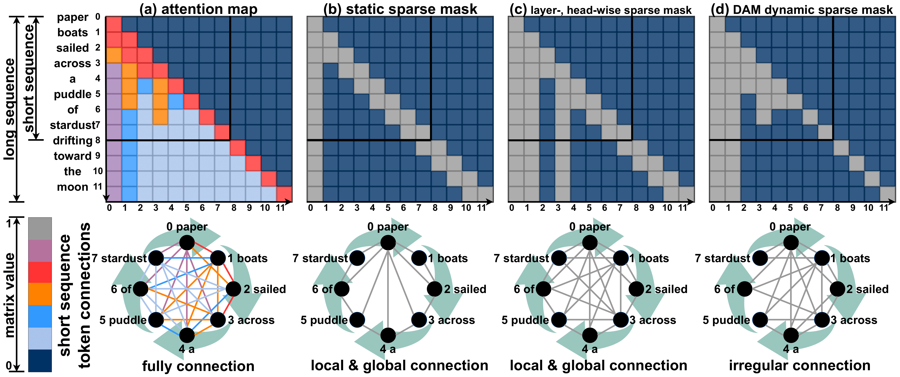
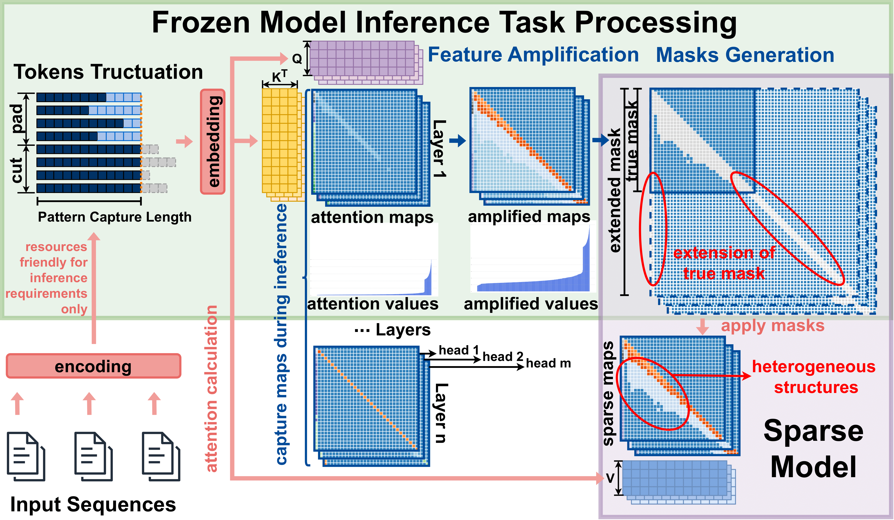
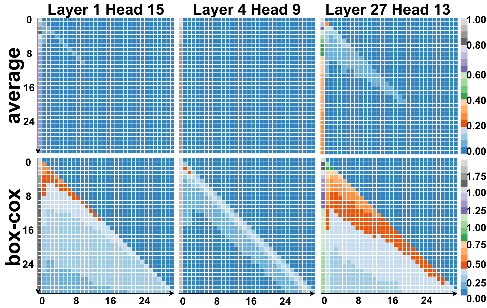
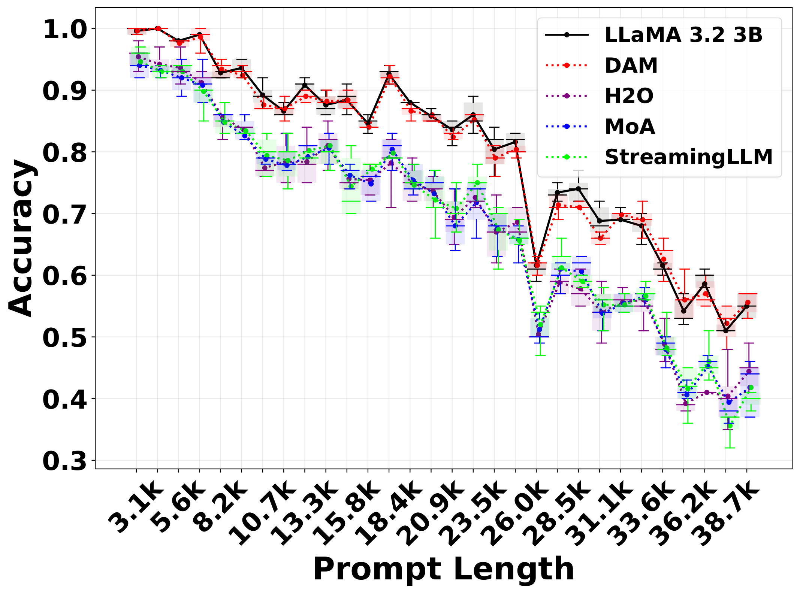
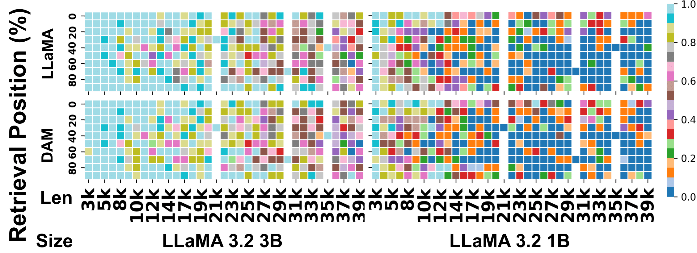
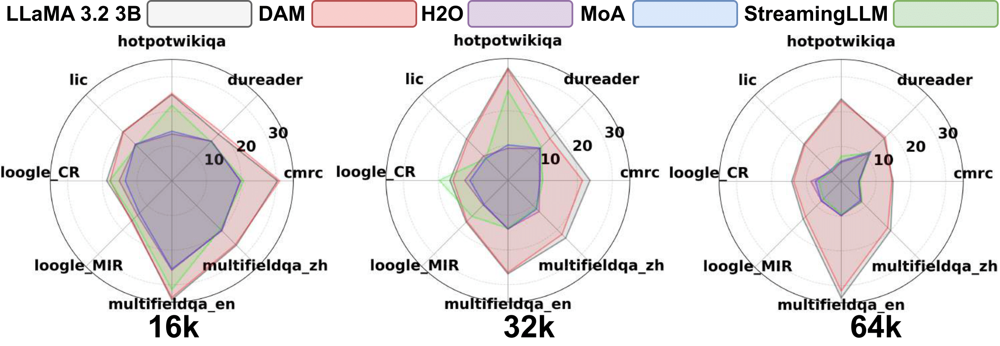

# 🎯 DAM: Dynamic Attention Mask for Long-Context LLM Inference Acceleration

<div align="center">

**A Novel Framework for Efficient Long-Context Inference in Large Language Models**

<!-- [](https://github.com/HanzhiZhang-Ulrica/DAM) -->
[](https://github.com/HanzhiZhang-Ulrica/DAM)

</div>

---

## 📖 Abstract

**DAM (Dynamic Attention Mask)** introduces a breakthrough approach to long-context inference in large language models. Unlike traditional sparse attention methods that rely on static, predefined patterns, DAM dynamically learns adaptive attention masks at the granularity of individual attention maps. This preserves the heterogeneous patterns across different layers and heads while significantly reducing computational overhead.

**Key Innovation:** DAM eliminates the need for fine-tuning by learning context-aware attention structures from frozen pretrained models, making it immediately applicable to existing LLMs without modification.

**Authors:** [Hanzhi Zhang](https://hanzhizhang-ulrica.github.io/), Heng Fan, Kewei Sha, Yan Huang, Yunhe Feng

<div align="center">

<br><em>Comparison of attention patterns: (a) full attention, (b) static sparse attention, (c) predefined patterns, and (d) DAM's dynamic heterogeneous patterns.</em>
</div>

---

## 🔬 Methodology Overview

<div align="center">

<br><em>Two-stage DAM framework: Pattern extraction and transformation (Stage 1) followed by efficient sparse inference (Stage 2).</em>
</div>

DAM operates through a **two-stage framework** that dynamically learns sparse attention patterns:

### 🔍 **Stage 1: Pattern Extraction**

DAM first extracts attention patterns from a frozen pretrained model processing sequences up to Pattern Capture Length (PCL). The baseline attention computation follows:

```
S = QK^T / √d_k
```

where `Q ∈ ℝ^(n×d_k)` and `K ∈ ℝ^(m×d_k)` are query and key matrices.

**Feature Amplification via Box-Cox Transformation:**
To enhance pattern visibility, we apply Box-Cox transformation to mean attention scores:

```
B_ℓ,h,i,j = { (X_ℓ,h,i,j^λ - 1) / λ,  if λ ≠ 0
            { ln(X_ℓ,h,i,j),           if λ = 0
```

where `X_ℓ,h,i,j = max(Ā_ℓ,h,i,j, ε)` are the stabilized mean attention values.

**True Mask Generation:**
Binary masks are generated through thresholding:

```
m_i,j = { 1, if Ã_ℓ,h,i,j ≥ τ
        { 0, if Ã_ℓ,h,i,j < τ
```

where `τ` is the threshold parameter and `Ã_ℓ,h,i,j` are the normalized attention values.

<div align="center">

<br><em>Box-Cox transformation (bottom) enhances pattern visibility compared to averaging (top), revealing heterogeneous structures in attention maps.</em>
</div>

### ⚡ **Stage 2: Sparse Inference**

**Dynamic Mask Generation via Pattern Matching:**
For sequences longer than PCL, we use structural pattern matching. Each pattern `P_k` is compared against true masks `M_ℓ,h` using similarity scores:

```
γ_k = (Σ_i,j M_ℓ,h(i,j) · P_k(i,j)) / (Σ_i,j P_k(i,j))
```

A pattern is matched if `γ_k ≥ μ`, where `μ` is the matching threshold.

**Extended Mask Construction:**
The final extended mask combines all matched patterns:

```
M̃_ℓ,h = Σ_{P_k ∈ P, γ_k ≥ μ} P_k
```

**Sparse Attention Application:**
The sparse attention is computed as:

```
A'_ℓ,h = (Q_ℓ,h K_ℓ,h^T / √d_k) ⊙ M̃_ℓ,h
```

where `⊙` denotes element-wise multiplication, effectively setting masked positions to `-∞` before softmax normalization.

---

## ✨ Key Features

<div align="center">

| Feature | Description |
|---------|-------------|
| 🎯 **Dynamic Sparse Attention** | Learns adaptive, context-aware sparse masks for each attention map |
| 🚀 **Zero Fine-Tuning** | Works with frozen pretrained models; no retraining required |
| 📈 **Scalable Architecture** | Efficiently extends to long contexts beyond hardware memory limits |
| 🎯 **High Accuracy** | Maintains performance close to full attention on benchmarks |
| ⚡ **Optimized Kernels** | Custom Triton kernels for efficient sparse computation |

</div>

---

## 📊 Key Results

DAM demonstrates superior performance across multiple benchmarks and model sizes:

- **🎯 Accuracy:** Maintains 79.66% average accuracy on LongEval (vs. 80.11% for full attention)
- **⚡ Efficiency:** Enables 8K token inference where full attention fails (OOM)
- **📈 Scalability:** Processes sequences up to 64K tokens with minimal degradation
- **🔧 Compatibility:** Works across different model sizes (1B, 3B, 7B parameters)

### **Long-Context Performance**

<div align="center">

<br><em>Retrieval accuracy on LongEval benchmark (3.1k to 38.7k tokens). DAM maintains consistent performance while baselines degrade.</em>
</div>

### **Model Comparison**

<div align="center">

<br><em>Detailed comparison for LLaMA 3.2 models. DAM closely matches dense attention across various positions and sequence lengths.</em>
</div>

### **Benchmark Evaluation**

<div align="center">

<br><em>LV-Eval scores on long-context QA tasks. DAM achieves 18.61 at 64K tokens, significantly outperforming alternatives.</em>
</div>

---

## 📝 Citation

If you find DAM useful in your research, please cite our work:

<!-- Citation will be added once paper is published -->

<!-- When arXiv version is available, update citation with:
journal={arXiv preprint arXiv:XXXX.XXXX},
-->

---

## 🙏 Acknowledgements

<div align="center">

**[LLaVi Lab](https://llavi-lab.github.io/), University of North Texas**

*Built with* 🤗 *HuggingFace Transformers* • *Triton* • *PyTorch*

</div>

---

<div align="center">
<strong>For more details, see our <a href="https://github.com/HanzhiZhang-Ulrica/DAM">project paper</a></strong>
</div> 